# Figci-Plugin

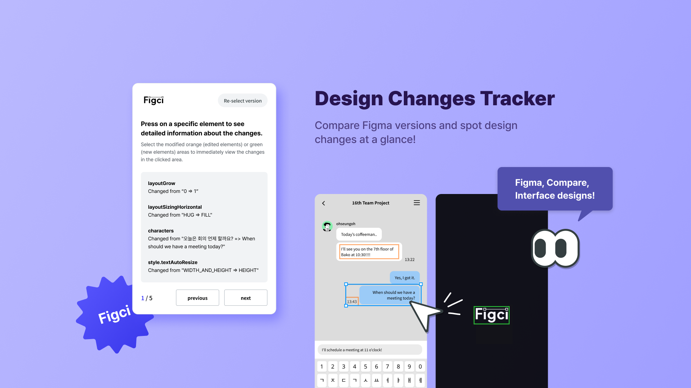

**Figci (Figma, Compare, Interface designs)**

<br />
<br />

# 1. Service Introduction

## 💡 Motivation

디자이너였던 팀원이 현업에서 개발자와의 협업 중 겪었던 불편함을 해결하기 위해 아이디어를 구상했습니다.<br />
이 아이디어로 해결하고자 한 주요 문제점은 다음과 같습니다.

### 1) 의사소통 비용 최소화

디자이너가 변경된 디자인 시안을 개발자에게 전달할 때, 변경된 부분을 일일이 코멘트로 달거나 정리해서 전달해야 했는데<br />
이때 발생하는 의사소통 과정을 줄이기 위해 개발자도 변경사항을 시각적으로 쉽게 파악할 수 있는 방법이 없을지 고민했습니다.

### 2) Git 의 스테이징 기술 구현

Git에서는 코드의 변경 사항을 초록색 또는 빨간색으로 표시해 주어, 누구나 추가된 부분과 삭제된 부분을 알 수 있는데<br />
이에 착안하여 디자인의 변경사항도 초록색 또는 주황색으로 강조 표시해 변경된 요소를 쉽게 파악할 수 있도록 아이디어를 구상했습니다.

<br />

## 🚀 Stacks

### FrontEnd

<div style="display:flex;">
  
  
  
  
  
  
</div>

### BackEnd

<div style="display:flex;">
  
  
  
  
  
</div>

### Tools

<div style="display:flex;">
  
  
</div>

### Collaboration

<div style="display:flex;">
  
  
  
</div>

<br />
<br />

# 2. Feature

### 1) 프로젝트 버전 선택

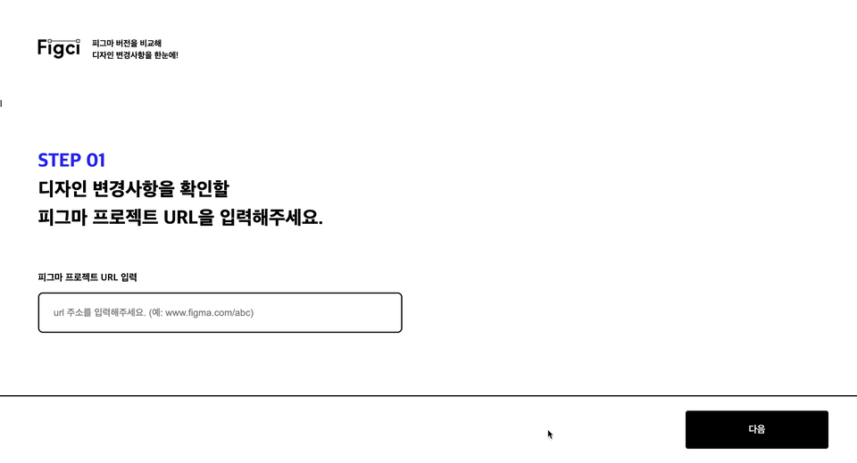

→ 사용자가 변경사항을 확인하고 싶은 프로젝트의 링크를 입력하면 해당 프로젝트의 모든 버전 리스트가 나타나며, 사용자가 비교하고자 하는 두 버전을 선택할 수 있습니다.

> 이전 버전이 이후 버전 보다 나중 일 수는 없습니다.<br />
> 만약, 이전 버전이 이후 버전보다 나중일 경우에는 에러메세지를 나타내는 토스트가 렌더링 됩니다.

<br />

### 2) 변경사항 시각화

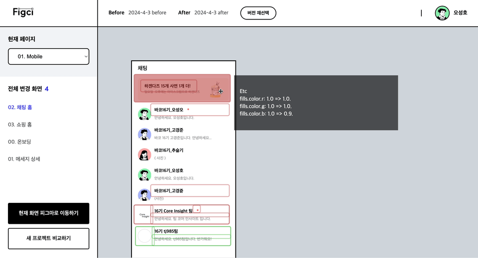

→ 사용자가 선택한 두 버전에 공통으로 존재하는 페이지 중 하나를 선택하면 해당 페이지에 있는
모든 변경사항이 있는 프레임들을 렌더링한 뒤, 변경사항을 시각화합니다.

> 빨간색 테두리는 이전 버전과 대비하여 이후버전에서 변경사항이 생긴 요소 입니다. <br />
> 초록색 테두리는 이전 버전에는 존재하지 않았으나, 이후 버전에서 새롭게 추가된 요소입니다.

각각의 테두리에 마우스를 hover할 시 디테일한 변경사항을 표시해줍니다.

<br />

### 새로운 버전 선택 및 피그마로 이동하기


→ 사용자가 변경사항을 확인하다가 새로운 버전 비교를 원할 경우, 버전 재선택 버튼을 클릭하면 버전 선택 화면으로 리디렉션됩니다.<br />

사용자가 현재 확인 중인 변경사항을 피그마 애플리케이션에서 보고자 한다면, 현재 화면 피그마로 이동하기 버튼을 클릭할 수 있습니다.<br />
클릭 시 해당 프레임이 존재하는 피그마 프로젝트로 이동할 수 있습니다.

<br />

### 3) 변경사항 페이지네이션 (플러그인)

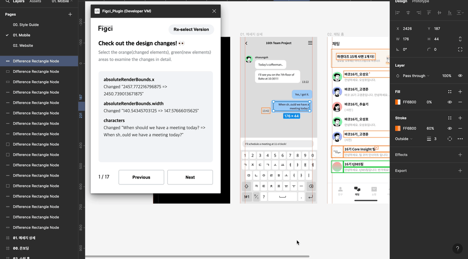

→ 변경사항이 있는 모든 요소들을 직접 클릭해서 확인 할 수도 있지만,
화살표 버튼을 통해서 변경사항이 있는 요소들을 하나씩 확인 할 수도 있습니다.

<br />
<br />

# 3. Challenge

## 🤔 Diffing: 효율적인 차이 분석 로직을 향한 여정

### 1) 초기 접근 방식: 동시 트리 순회

저희 서비스를 구현하기 위해서는 유저가 두개의 버전을 선택하면 해당 버전의 변경사항을 도출해 내야 했습니다.<br />
처음에는 Figma API를 통해 받은 두 서브트리를 동시에 순회하면서, 같은 위치에 있는 노드들의 프로퍼티를 비교하여 차이점을 찾았습니다.<br />
이 방법은 한 번의 순회로 모든 변경사항을 찾을 수 있었으며, `O(n)`의 시간 복잡도를 가져갈 수 있었습니다.

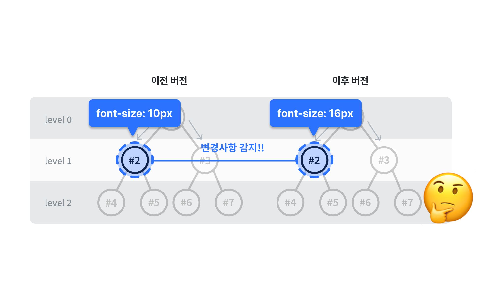

<br />

다만 이런 방식에는 한가지 문제점이 있었습니다.<br />

한쪽 버전에서 노드가 추가되거나 삭제될 경우, 트리의 구조가 바뀌어버려 동시 순회 시 두 트리가 서로 다른 노드를 바라보는 문제가 발생했습니다.<br />
이로 인해 변경사항이 없는 노드들마저 변경된 것으로 잘못 식별되는 이슈가 발생했습니다.

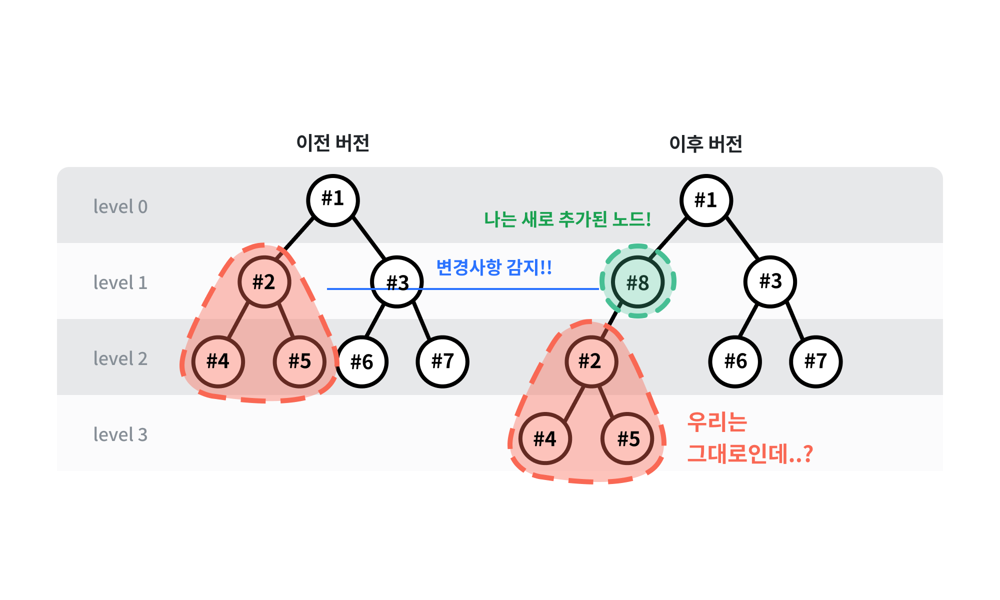

<br />

### 2) 해결책 : 트리 평탄화

이 문제의 원인이 트리의 깊이에 있음을 파악한 저희는, Figma 데이터를 평탄화하기로 결정하고,<br />
두 트리를 동시에 순회하는 방법을 포기했습니다.

<br />

### 3) 수정된 접근 방식 : 노드 ID를 기준으로 한 트리 순회

수정된 차이 분석 로직에서는 노드들을 평탄화한 후, 한쪽 트리를 기준으로 순회하며 해당 노드의 `NodeId`가 다른 트리에 존재하는지를 확인합니다.<br />
동일한 `NodeId`를 가진 노드가 존재한다면, 그들의 프로퍼티를 비교하여 변경사항을 확인합니다.<br />
이처럼 수정된 로직으로는 저희가 예상했던 정확한 변경사항을 도출할 수 있었습니다.

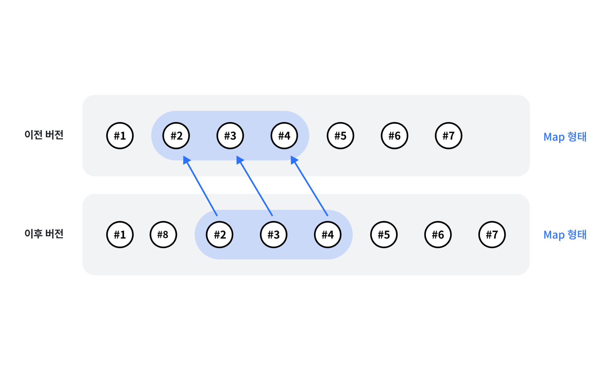

<br />

초기 로직이 `O(n)`의 시간 복잡도를 가졌던 반면, 수정된 로직은 `O(n^2)`의 시간 복잡도를 가집니다.<br />
왜냐하면 각 `NodeId`가 다른 평탄화된 트리에 존재하는지 검색해야 하기 때문입니다.<br />
그럼에도 불구하고 정확한 변경사항 도출이 더 우선순위라고 판단한 저희는 이 새로운 로직을 채택했습니다.

<br />

## 🗄️ 복잡한 피그마 Data를 MongoDB에 어떻게 저장할까?

### 1) 초기 접근 방식: 피그마 JSON 데이터 저장 방식 고려

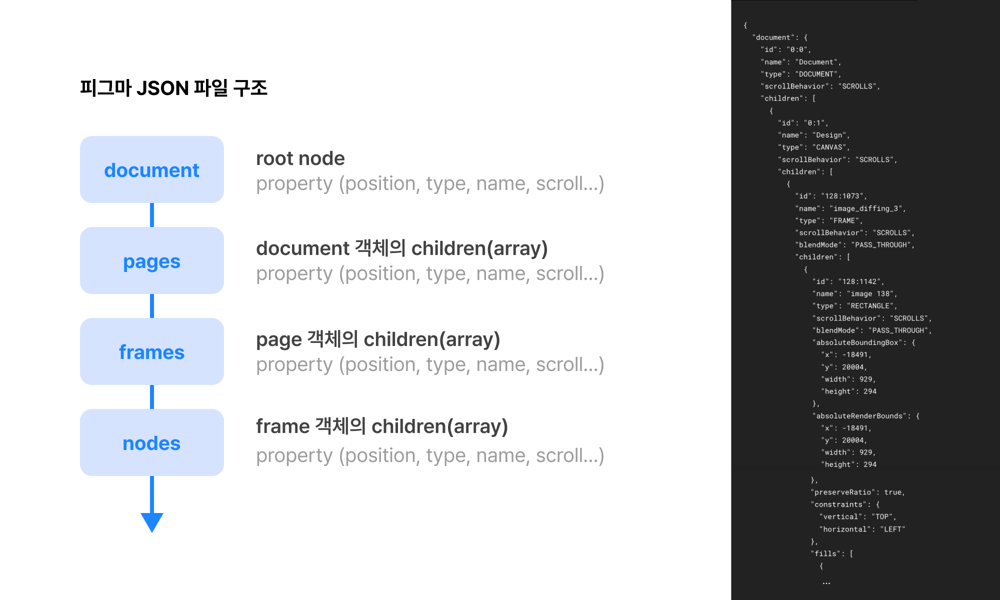

피그마 파일의 트리 구조는 피그마 파일 구조의 데이터들이 모두 들어가있기 때문에<br />
`Document` - `Pages` - `Frames` - `Nodes` 순으로 중첩되고 많은 데이터를 포함하고 있습니다.

저희는 동일한 파일의 버전 간 데이터 비교와 디자인된 화면을 캔버스에 구현하기 위해<br />
피그마 파일 트리구조를 그대로 보존하면서 MongoDB의 관계형 데이터베이스 구조에 맞게 저장해야 했습니다.

<br />

### 2) 해결책 : 피그마 파일 스키마 구조화

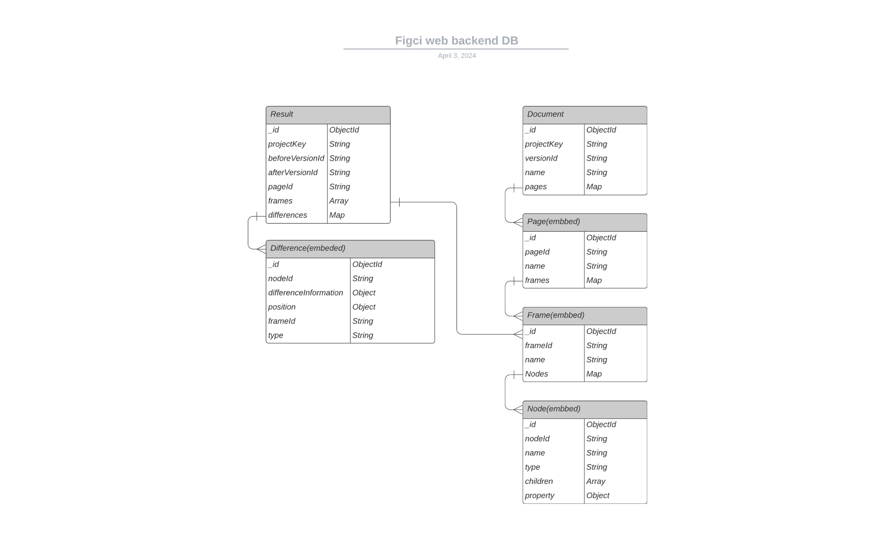

초반에는, `NodeSchema`를 트리 구조 그대로 저장했었습니다. `Frame` 내부에 있는 `Nodes` 데이터 안에 많은 정보들이 집중되어 있었기 때문에<br />
한번에 트리 구조를 Database에 넣는 것은 MongoDB의 문서 용량 제한 문제나 데이터의 무결성을 유지하기도 어려웠습니다.

해당 구조를 그대로 저장하다보니 (동시에 순회를 하지않는다고 가정 해도) 트리구조의 깊은 중첩 탓에 비교하고 싶은 값에 한번에 접근하기가 쉽지 않았고,<br />
이를 해결하기 위해 저희는 `NodeSchema`에 트리 구조 그대로 저장하는 대신 `DFS` 알고리즘을 활용하여<br />
Node 데이터를 평탄화 시킨 뒤 DB에 저장함으로 써 트리 구조의 효율적인 관리가 가능해졌습니다.

<br />

## 🎨 피그마 JSON 파일을 어떻게 렌더할 수 있을까?

### 1) 피그마 JSON 파일은 어떻게 구성되어 있을까?

**피그마 속성 분류**<br />
서버로부터 전달받은 Figma JSON 트리를 Fabric.js를 사용하여 캔버스에 렌더링해야 했습니다.<br />
피그마 내부 디자인 시스템에서 사용하는 "시스템 속성"과 실제 렌더에 관여하는 "디자인 속성"으로 나누어서 속성을 분류했습니다.

```javascript
// 디자인 속성 (실제 시각적인 렌더 관여하는 요소)
absoluteBoundingBox: { x, y, width, height },
absoluteRenderBounds: { x, y, width, height },
constraints: { vertical, horizontal },
clipsContent: true,
background: [{ blendMode, type, color }],
fills: [{ blendMode, type, color }],
strokes: [],
strokeWeight: 1,
strokeAlign: "INSIDE",
backgroundColor: { r, g, b, a },

// 시스템 속성 (피그마 디자인 시스템 관련 요소)
layoutAlign: "INHERIT",
layoutGrow: 0,
layoutSizingHorizontal: "FIXED",
layoutSizingVertical: "FIXED",
rectangleCornerRadii: [0, 0, 0, 0],
cornerSmoothing: 0,
effects: [],
componentId: "37:17",
componentProperties: { Primary, Secondary, Line, "full CTA" },
overrides: [ { id, overriddenFields },
```

<br />

### 2) 도형이나 이미지를 어떻게 다르게 렌더할 수 있을까?

**피그마 타입별 렌더 함수 작성**<br />
피그마 JSON 데이터의 타입별로 Fabric.js 객체로 변환하는 함수를 만들어서 작성하였습니다.

```javascript
// 피그마 타입별 렌더함수 맵핑
const renderFunctionByFigmaType = {
  BOOLEAN_OPERATION: renderRect,
  COMPONENT: renderRect,
  ELLIPSE: renderEllipse,
  FRAME: renderFrame,
  GROUP: renderRect,
  INSTANCE: renderRect,
  MODIFIED: renderDifference,
  NEW: renderNewFrame,
  NEW_FRAME: renderNewFrameInfo,
  REGULAR_POLYGON: renderTriangle,
  RECTANGLE: renderRect,
  TEXT: renderText,
  VECTOR: renderRect,
  LINE: renderRect,
};
```

<br />

### 3) 요소 간 발생하는 이벤트에 따라 상호작용하게 할 수 없을까?

사용자 경험을 고려하기 위해 이전 버전과 비교해 **변경사항이 감지된 영역을 먼저 시각적으로 강조해 표시**하고<br />
사용자가 확인하기 원하는 영역에 마우스 이벤트가 발생했을 때만 변경된 내용이 보여지게 하고 싶었습니다.

`fabric.js`를 `set`메서드를 사용해서 렌더링 전에 마우스 이벤트 핸들러를 추가하여<br />
마우스 이벤트 발생에 따라 변경내용이 보여지도록 **변경영역 도형과 변경사항 텍스트의 속성을 맵핑 후 렌더**하였습니다.

```javascript
rectObject.on("mouseover", () => {
  const [r, g, b, o] = getRGBNumber(rectObject.fill);
  const mouseoverColor = `rgba(${r}, ${g}, ${b}, 0.5)`;

  rectObject.set({
    fill: mouseoverColor,
  });
  textObject.set({
    visible: true,
  });
  this.renderAll();
});

rectObject.on("mouseout", () => {
  const [r, g, b, o] = getRGBNumber(rectObject.fill);
  const mouseoutColor = `rgba(${r}, ${g}, ${b}, 0)`;

  rectObject.set({
    fill: mouseoutColor,
  });
  textObject.set({
    visible: false,
  });
  this.renderAll();
});
```

<br />

### 4) 피그마에 디자인 시스템 속성은 어떻게 구현할 수 있을까?

렌더하면서 어려웠던 부분 중 하나는 피그마 디자인 시스템에서 사용하는 속성을 JSON 데이터로 부터 구현하는 것이었습니다.<br />
그 중 clipPath 속성을 구현하지 못해 자식 노드가 부모 노드의 크기를 벗어나 실제 디자인과 다르게 그려지는 문제가 발생했습니다.

<br />

> [!NOTE] <br /> > **`clipPath` 관련 속성**<br />
>
> Figma 데이터에서 `clipsContent` 속성값을 확인하였습니다.<br />`clipsContent`가 true인 경우, 연결된 자식 노드를 찾아 `Fabric.js`객체로 변환하고<br /> `clipPath` 속성에 부모 노드를 추가하여 자식 노드와 부모 노드를 연결하였습니다.

```javascript
if (frameJSON.property.clipsContent === true) {
  const clipTargetNode = fabricObject.get(frameJSON.frameId);

  clipTargetNode.absolutePositioned = true;
  fabricObject.set(frameJSON.frameId, clipTargetNode);

  for (const fabricObjectId in fabricObject) {
    const isChildFrame = fabricObjectId !== frameJSON.frameId;
    const isNotClipped = !fabricObject.get(fabricObjectId)?.clipPath;

    if (isChildFrame && isNotClipped) {
      const clippedTargetNode = fabricObject.get(fabricObjectId);

      clippedTargetNode.clipPath = clipTargetNode;
      fabricObject.set(fabricObjectId, clippedTargetNode);
    }
  }
}
```

<br />

## 4. 플러그인에서는 OAuth 로그인을 어떻게 구현해야 할까?

### 1) 플러그인 환경에서는 redirect가 되지 않는다?

OAuth 2.0의 동작 과정은 사용자가 인증 서버에서 로그인하고 인증을 완료한 후,<br />
저희가 등록한 `redirectURL`로 리디렉션하는 단계를 포함합니다.

이 과정에서 **Authorization Server**는 권한 부여 승인을 위해 자체 생성한 Authorization Code 를`redirectURL` 로 전달하고,<br />
클라이언트에서 해당 Authorization Code로 보호된 자원에 요청할 수있는 AccessToken을 발급해주는 방식으로 동작합니다.

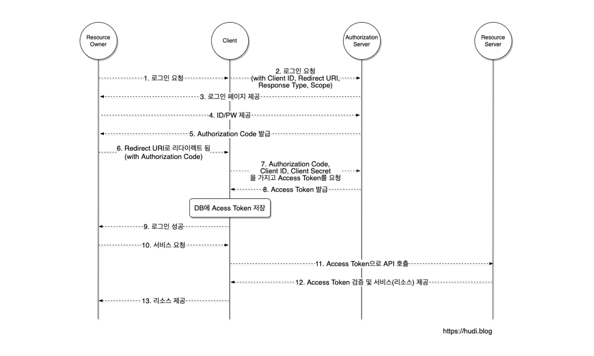

<br />

그러나 이러한 매커니즘은 Figma 플러그인에서는 작동하지 않았습니다.<br />
Figma 플러그인은 웹 브라우저가 아닌 Figma 애플리케이션(일렉트론 앱) 에서 실행되어<br />
브라우저의 redirect 메커니즘이 그대로 적용되지 않기 때문이었습니다.<br />

**Authorization Server**로부터 리디렉션이 일어나는 과정을<br />플러그인 환경에서 클라이언트 측에서 처리하는 것이 불가능했습니다.

_**이 문제를 해결하기 위해 저희는 OAuth인증을 저희가 구축해놓은 서버로 우회하여 처리하는 방법을 생각해냈습니다.**_

<br />

### 2) 서버로 우회하여 OAuth인증을 받자!

**저희가 생각해낸 방법은,**

사용자가 로그인을 하게 되면 **Authorization Server**에서는 기존에 등록된 서버의 엔드포인트로 redirect 요청을 보내고,<br />
서버에서 OAuth 2.0인증을 통해 AccessToken을 발급 받으면,<br />
플러그인 클라이언트에게 발급받은 AccessToken을 전달해주는 방식이었습니다.

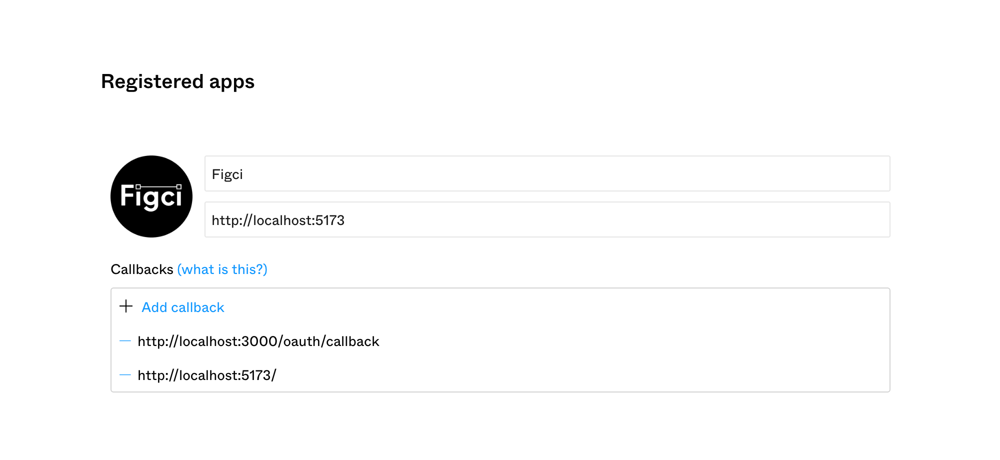

→ Callback URL에 서버측 엔드포인트를 추가해 주어서 redirect 요청을 서버로 우회하여 받을 수 있게끔 하였습니다.

<br />

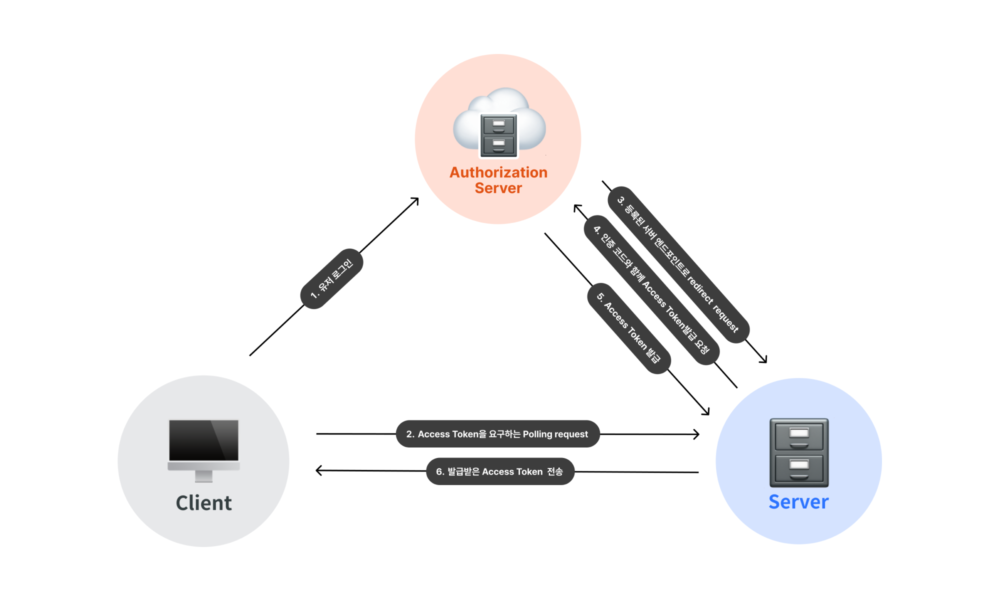

_→ 서버로 redirectURL을 우회하여 AccessToken을 클라이언트 측으로 전달하는 로직을 시각화 한 것._

<br />

이때 서버 측에서 모든 인증이 완료되어 AccessToken이 성공적으로 발급되었다면,<br />
`Server Side Rendering` 으로 만들어진 로그인 완료 페이지를 응답으로 보내 UX를 개선했습니다.

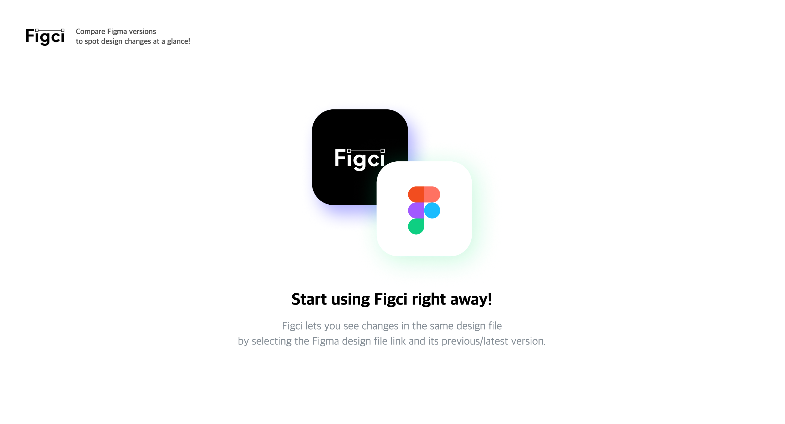

<br />

### 3) 근데.. 클라이언트 측에서 인증 완료 여부를 어떻게 알지..? 😳

다만 서버로 우회하는 OAuth로그인 방식을 구현하면서 마주했던 또다른 문제점은

**_Authorization Server_** 에서 저희 서버로 요청을 보낸 request-response life cycle 내부에서 AccessToken이 생성되는 것이므로<br />
**_플러그인 클라이언트 측에서는 서버 측에서 인증을 성공하여 AccessToken을 정상적으로 발급을 받았는지 알수있는 방법이 없었습니다._**<br />
**_이를 해결하기 위해서 저희는 `Polling` 기법을 사용했습니다._**

<br />

&ensp; **• `Polling` 이란?**

&emsp; → 클라이언트가 일정한 주기(특정한 시간)을 가지고 서버와 응답을 주고 받는 방식으로 <br />
&emsp; 웹소켓과 같은 특정한 프로토콜을 사용하지 않아도 아주 간단히 서버와 지속적인 커넥션을 유지할수 있는 방법 입니다.

&emsp; 즉, 클라이언트는 일정 주기마다 서버에 요청을 계속 보내, 지속적으로 최신 데이터 상태를 유지할 수 있습니다.

&emsp; 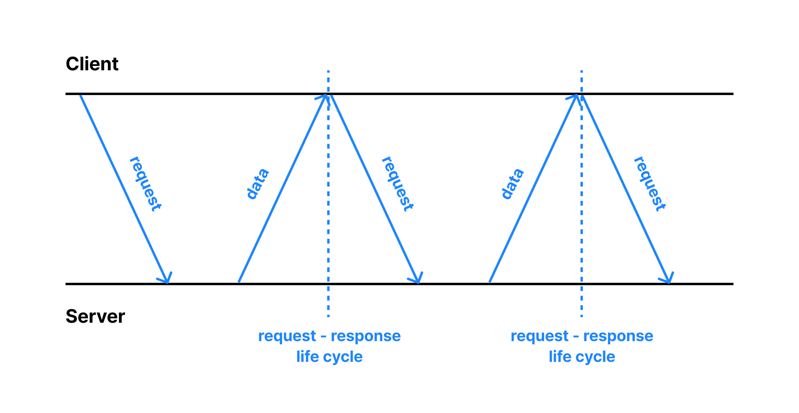

<br />

클라이언트 측에서는 로그인을 완료를 하게되면, <br />
해당 시점 이후부터는 일정한 시간마다 서버에 지속적으로 AccessToken 전달을 요청하는 request를 보내게 됩니다.<br />
서버측에서는 인증이 성공적으로 완료가 되어서 AccessToken을 발급 받았다면 <br />
해당 AccessToken을 클라이언트의 `Polling`요청에 대해서 응답으로 보내게 됩니다.

클라이언트 측에서는 AccessToken을 응답으로 받게 되면, 서버로 Polling 요청을 중단합니다. <br />
이렇게 OAuth 로그인을 구현함으로써 플러그인 환경에서도 AccessToken을 발급받아 Figma REST API를 사용 할 수 있었습니다.<br />

<br />
<br />

# 4. Issue

## 🙅‍♂️ 캔버스에 이벤트가 발생하지 않는다?!

사용자가 강조 표시된 Rectangle 마우스 호버 이벤트 발생시 변경 사항 Textbox 을 보여지게 하고 싶었으나<br /> 캔버스에 이벤트 자체가 발생하지 않는 문제가 발생했습니다.

<br />

### 1) 문제 원인

Fabric.js에서는 객체가 그려지는 `lower.canvas`와 사용자 이벤트를 처리하는 `upper.canvas`가 분리되어 있는데<br /> 이벤트 처리를 담당하는 `upper.canvas` 에 문제가 있다고 판단했습니다.

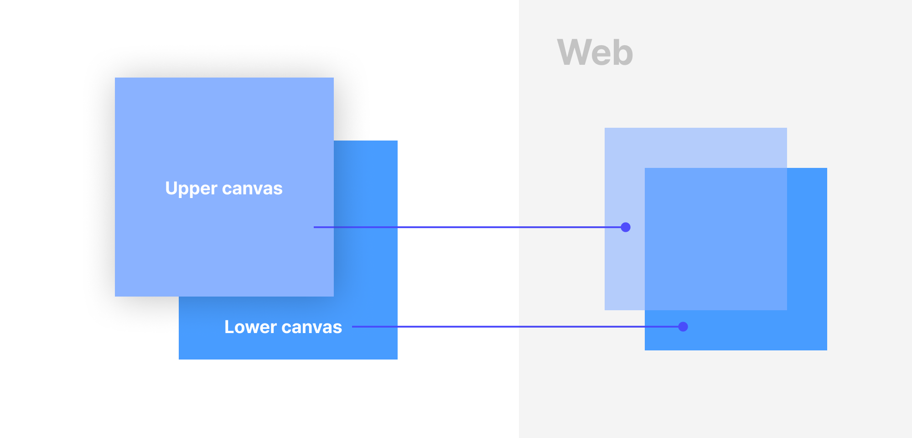

개발자 모드 layer 탭에서 확인한 결과 `upper.canvas`가 두번 생성되어 사용자 이벤트가 제대로 전달되지 않았다는 것을 가정하고<br />
`canvas`가 반복적으로 렌더되는 부분을 확인했습니다.

<br />

### 2) 왜 `upper.canvas` 가 두 번 생성이 되고있을까?

React.StrictMode로 인해 useEffect가 2번 실행되어서 upper.canvas가 두 번 생성되어서 이로인해 사용자 이벤트가 lower.canvas 객체로 제대로 전달되지 않는 문제ㅏ 발생 함수 시절
fabric.js 캔버스의 sideEffect 처리를 하지 않아 발생한 문제로 판단하여서 언마운트시 캔버스가 초기화 되도록 fabric.js 의 `dispose` 메서드를 활용하여서 클리어 함수 로직을 추가하였습니다.

`.dispose` : `.clear` + 캐시 데이터까지 모두 삭제하는 메서드

```javascript
useEffect(() => {
  // Fabric.js 초기화 함수
  const clearCanvas = () => {
    if (canvasRef.current) {
      canvasRef.current.dispose(); // 모든 캔버스 설정 삭제
    }
  };

  return () => {
    clearCanvas(); // Fabric.js 초기화 함수 실행
  };
}, []);
```

| sideEffect 처리 전                                                                          | sideEffect 처리 후                                                                          |
| ------------------------------------------------------------------------------------------- | ------------------------------------------------------------------------------------------- |
| 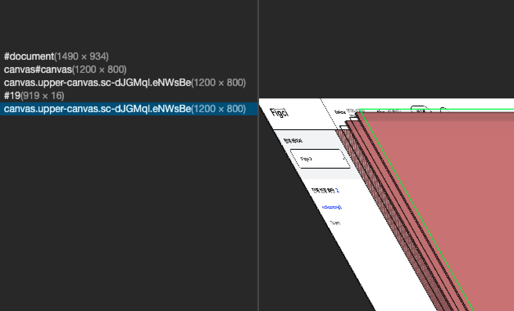 | 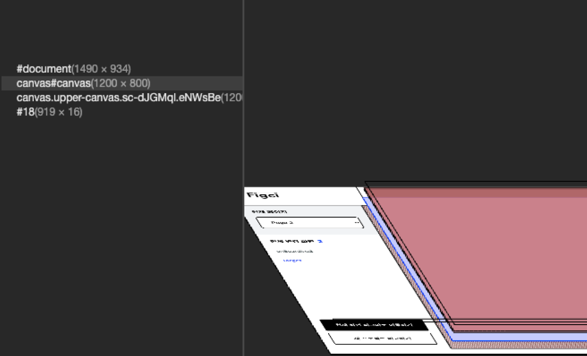 |

**→ 사이드 이펙트 처리함으로서 `upper.canvas` 가 중복으로 생성되는 문제를 해결하고, 캔버스 이벤트가 정상적으로 `lower.canvas` 객체에게 전달되도록 했습니다.**

<br />

## 2. 피그마에 렌더되어있는 순서를 어떻게 보장할수 있을까?

피그마에서는 z-index를 디자인 요소의 중첩 구조에 따라서 구분하는데 서버로부터 전달받은 JSON 파일에서는<br />
실제 중첩된 구조와 다르게 평탄화 되있어 실제 피그마 디자인과 순서와 다르게 나중에 렌더되어<br />
앞에 있어야 할 디자인 요소가 **뒤로 가려져 보이지 않는 문제가 발생**했습니다.

→ 실제 피그마에서 중첩되어있는 구조를 보장하면서 평탄화 하기위해 평탄화를 위한 탐색법으로<br />
DFS에서 BFS로 변경해 실제 피그마 디자인 중첩 구조대로 평탄화 할 수 있었습니다.

<br />

### 3. 평탄화 되어있는 디자인 요소의 순서를 보장 할 수 없을까?

평탄화 되어있는 디자인 요소 데이터를 순서대로 렌더하기 위해서 json 데이터를 순회하려 더했으나 객체에서는 객체가 생성된 순서를 보장하지 않으므로 실제 디자인과 다르게 렌더 되는 문제가 발생했습니다.

→ 평탄화한 디자인 요소의 순서를 보장하기 위해서 기존 Object 형태에서 Map 형태로 변경하여서 디자인 요소를 평탄화한 순서대로 렌더하게 하여서 실제 피그마 디자인상에 중첩되어있는 순서대로 디자인 요소를 렌더 할 수 있었습니다.

<br />
<br />

# 4. Team Culture & Convention

## 📋 Team Culture

<details>
<summary>Team Culture가 궁금하시다면</summary>
<div markdown="1">

### Team Culture

1. 회의록은 순서대로 돌아가면서 작성
2. 코어타임은 **오전 11시 - 오후 11시**
3. 1분이라도 지각한 사람은 커피사기
4. 점심시간 오후 12시 30분, 저녁시간 오후 6시
5. 공지 확인 시 12시간 내에 답장 해주기 + 공지 확인 후에 ✅ 체크 필수
6. 공부하다 모르는 내용 생기면 공유하고 서로 같이 고민하기

<br />

</div>
</details>

<br />

## 🤝 Convention

<details>
<summary>Convention이 궁금하시다면</summary>
<div markdown="1">

<br />

### Convention

**(1) `Commit Convention`**

| 커밋 유형          | 의미                                                         |
| ------------------ | ------------------------------------------------------------ |
| ✨ [Feat]          | 새로운 기능 추가                                             |
| 🐛 / 🚑 [Fix]      | 버그 수정                                                    |
| 📝 [Docs]          | 문서 수정                                                    |
| ✏️ [Style]         | 코드 formatting, 세미콜론 누락, 코드 자체의 변경이 없는 경우 |
| ♻️ [Refactor]      | 코드 리팩토링                                                |
| ✅ [Test]          | 테스트 코드, 리팩토링 테스트 코드 추가                       |
| 📦[Chore]          | 패키지 매니저 수정, 그 외 기타 수정 ex) .gitignore           |
| 💄[Design]         | CSS 등 사용자 UI 디자인 변경                                 |
| 💬[Comment]        | 필요한 주석 추가 및 변경                                     |
| 🚚[Rename]         | 파일 또는 폴더 명을 수정하거나 옮기는 작업만인 경우          |
| 🔥[Remove]         | 파일을 삭제하는 작업만 수행한 경우                           |
| 🔨!BREAKING CHANGE | 커다란 API 변경의 경우                                       |
| 🐛!HOTFIX          | 급하게 치명적인 버그를 고쳐야 하는 경우                      |

<br />

1. **_커밋 유형은 영어 대문자로 작성하기_**

- 예: [Feat] 로그인 구현

2. **_제목과 본문을 빈행으로 분리_**

- 커밋 유형 이후 제목과 본문은 한글로 작성하여 내용이 잘 전달될 수 있도록 할 것
- 본문에는 변경한 내용과 이유 설명 (어떻게보다는 무엇 & 왜를 설명)

3. **_제목과 본문은 한글로 작성_**
4. **_자신의 코드가 직관적으로 바로 파악할 수 있다고 생각하지 말자_**
5. **_반드시 너무 많은 작업 단위를 담지 말자_**

- 추적 가능하게 유지해주기
- 너무 많은 문제를 한 커밋에 담으면 추적하기 어렵다.

<br />

**(2) `PR Convention`**

1. **_PR 제목 양식을 지키자._**
   commit제목:✔️어떤 task를 수정했는지 - **`Chore: lodash 패키지 추가`** - **`Refactor: 클라이언트 서비스 추가 / 안쓰는 변수 삭제`\*\***`Feat: users/user_id/project 엔드포인트 및 라우터 추가`\*\*
2. **_반드시 최신 버전을 rebase한 뒤 PR을 올리자_**
3. **_PR의 머지가 급한 상황에는 Slack을 통해서 한번 더 동료들에게 알리자_**
4. **_description, remarks, concern을 꼼꼼하게 정리정돈하여 작성하자._**
5. **_절대로 한꺼번에 Merge하지 말자._**
   PR이 여러개 있을 경우 코드가 유실되거나 꼬이지 않도록 주의.
6. **_PR에 Label을 지정하자_**

   쌓여있는 PR 리뷰 요청이 많아질 시 부채감으로 느끼지 않도록 PR 리뷰의 일정 공유를 통해 우선순위에 따라 라벨을 지정해줌.

   - `ASAP`: 현재 작업하던 일이 있더라도, 해당PR을 우선적으로 확인해 주세요
   - `TBR`: 현재 작업하던일이 마무리가 되면 해당 PR을 확인해 주세요

<br />

**(3) `CodeReview Convention`**

1. **_Pn규칙을 적용하여 의사소통과 작업시간의 능률을 올리도록 하자_**
   - `P1`: **꼭 반영해 주세요 (Request changes)**
   - `P2`: **웬만하면 반영해 주세요 (Request changes)**
   - `P3`: **반영해도 좋고 넘어가도 좋습니다 (Comment)**
2. **_리뷰는 최대한 꼼꼼하고 자세하게 하자._**
   1. 일관된 구조, 로직, 스타일을 유지하고 있는지
   2. 다른 해결 방법 의견 제시할 게 있는지
   3. 버그 발생 가능성이 있는지
   4. 기술적인 지식, 노하우, 히스토리 전달
3. **_추가적인 질문이나 피드백이 있을 경우, 적극적으로 작성하고 토론하자_**

<br />

</div>
</details>

<br />

## 👨‍👩‍👦 팀원 소개

<table>
  <tr>
    <td align="center" width="200">
      <a href="https://github.com/doitchuu" target="_blank">
        
      </a>
    </td>
    <td align="center" width="200">
      <a href="https://github.com/tjd985" target="_blank">
        
      </a>
    </td>
    <td align="center" width="200">
      <a href="https://github.com/kyeongjun-ko" target="_blank">
        
      </a>
    </td>
  </tr>
  <tr>
    <td align="center">
      <a href="https://github.com/doitchuu" target="_blank">
        추슬기
      </a>
    </td>
    <td align="center">
      <a href="https://github.com/tjd985" target="_blank">
        오성호
      </a>
    </td>
    <td align="center">
      <a href="https://github.com/kyeongjun-ko" target="_blank">
        고경준
      </a>
    </td>
  </tr>
  <tr>
    <td align="center">
      <a href="mailto:seulgichu14@gmail.com">seulgichu14@gmail.com</a>
    </td>
    <td align="center">
      <a href="mailto:tjd985@gmail.com">tjd985@gmail.com</a>
    </td>
    <td align="center">
      <a href="mailto:rhrudwnszoq@naver.com">rhrudwnszoq@naver.com</a>
    </td>
  </tr>
</table>

<br />
<br />

## ✍️ 회고

<details>
<summary>팀 회고</summary>
저희 팀원이 디자이너로서 실제 겪었던 불편함을 해결하고자 시작된 프로젝트인 만큼 집중할 수 있었고<br />
개발자나 디자이너와 협업하는 사용자가 서비스를 사용한다면 어떨까<br />
깊이 생각할 수 있던 프로젝트였습니다.<br />
<br />
사용자 경험을 가장 중요한 키워드로 생각하며 서로 적극적으로 토론하며 몰입도 있게 고민해보고<br />
실제 기술로 구현해 하나의 서비스를 완성해보는 경험 할 수 있어 뜻깊은 프로젝트 였습니다.

<br />
</details>

<details>
<summary>추슬기</summary>
디자이너로서의 경력을 통해, 협업 중 커뮤니케이션의 중요성을 항상 느꼈습니다. 이번 팀 프로젝트는 그런 저에게 협업을 통한 문제 해결을 경험하게 해준 시간이었습니다. 특히, 피그마 파일 구조를 파악하고 변경사항을 비교하며, 플러그인과 웹 환경과 같이 다른 생태계에서 개발하는 과정은 혼자서는 상당히 어려웠을 텐데, 팀 프로젝트를 통해 개발을 진행할 수 있어 3주라는 짧은 시간에도 좋은 결과물을 낼 수 있었습니다.

<br />

프로젝트 초반에는 피그마 파일의 복잡성과 예외 케이스들 때문에 실제 일정에 맞춰 구현할 수 있을지에 대한 불안감이 컸습니다. 그러나 팀원들과의 끊임없는 논의와 스터디를 통해 불안감을 극복할 수 있었고, 팀으로서 함께 성장하는 과정을 경험했습니다.
팀원들과 함께 밤을 새우며 개발하는 동안, 각자의 개발 스타일과 작업 방식을 조율하는 과정이 특히 기억에 남습니다. 서로 다른 배경을 가진 팀원들과의 협업은 때로 도전적이었고, 서로 의견의 방향이 다를 때도 있었지만, 경준님과 성호님의 배려와 협력 덕분에 프로젝트를 성공적으로 마칠 수 있었습니다. 협업하는 동안 서비스 사용자와 팀원들을 고려하면서 작업의 가독성을 높이고, 내용을 정리하며, PR에서 상대방이 코드를 쉽게 이해할 수 있도록 하는 배려가 중요하다는 것을 배웠습니다.

<br />

마지막으로, 디자이너로서의 제 경험이 프로젝트의 디자인 측면에서 큰 도움이 될 수 있어 기뻤고, 팀원들과의 긴밀한 협업을 통해 기술적인 측면에서도 많은 성장을 이룰 수 있었습니다. 이번 프로젝트는 저에게 단순한 기술적 성장뿐만 아니라, 팀과 함께하는 과정에서 배움과 성장의 가치를 일깨워준 뜻깊은 시간이었습니다. 이러한 경험은 앞으로 협업할 때 큰 자산이 될 것 같습니다.

<br />

</details>
<details>
<summary>오성호</summary>
이번 팀 프로젝트를 진행하며 코드 한 줄을 작성할 때마다,
제가 작성하는 코드가 더 이상 개인의 코드가 아닌 팀의 코드가 된다는 생각에
평소라면 금방 작성했을 코드 한 줄에도 훨씬 더 많은 시간과 신중함을 기울여야 했습니다.
프로젝트 기간 내에 서비스를 완성할 수 있을지에 대한 걱정도 많았지만, 목표 달성을 위해 열심히 노력하는 팀원들과 함께 밤을 지새우며 시간이 흐를수록 저의 걱정은 점차 확신으로 변해갔습니다.
이번 프로젝트를 통해 사소한 행동 하나까지도 팀원의 입장에서 고려하는 것이 얼마나 중요한지,
또한 개인의 작업 속도보다 팀 전체가 같은 방향성과 싱크를 유지하며 나아가는 것이 왜 중요한지 깨달았습니다.
이 경험은 앞으로 겪어야 할 개발자가 되기위한 날들 뿐만 아니라, 추후 개발자로 살아가는데 있어서 소중한 자산이 될 것이라고 확신합니다.

<br />

</details>
<details><summary>고경준</summary>
처음 회의 할 때 주제가 분산되서 명확한 의사결정 없이 회의가 마무리되는 날들이 있었습니다.
그래서 저희는 의사소통에 들어가는 비용을 최소화하고 실제 현업에서 일하는 방식대로 작업하기 위해
다른 기업들의 업무 방식을 찾아보게 되었고. 그 과정에서 여러 IT 기업의 문화나 일하는 방식에 대해 배울 수 있었고, 회의 시간과 규칙을 정하고 다양한 컨벤션을 하나씩 설정하게 되었습니다.
그러나 실제 개발을 시작하면서 미처 신경 쓰지 못했던 부분들이 드러나기 시작했고 그때마다 빠르게 의사소통하면서 함께 수정하고 가다듬어 나갔고 체계가 잡히고 2주차 부터는 체계화된 시스템 아래에서 낭비하는 시간 없이 효율적으로 작업할 수 있게 되었습니다.

<br />

이런 경험을 통해 팀 내의 컨벤션과 규칙이 프로젝트 개발 효율성을 높이는데 큰 영향을 미친다는것을 체감하게 되었고 불편한 점이 생기면 빠르게 의견을 반영해서 시스템을 개선해나가는것이 성공적인 프로젝트를 위해 반드시 필요한 과정이라는 것을 배울 수 있었습니다.
프로젝트 발표 1주전 이른 새벽 다같이 모여서 긴급회의를 했던 날이 생각납니다. 예상했던것 보다 태스크가 지연되고 일정 내에 기획한것을 모두 끝내지 못할것 같다는 위기감에 머리를 맞대고 남은 일정을 어떻게 조정해야 할지 치열하게 토론했습니다. 남은 일정을 세분화하고 하루 안에 반드시 끝내는 것을 목표로 다시 계획 했습니다.

<br />

결국, 일정 내에 모든 기능을 구현하면서 좋은 결과를 얻을 수 있었고 그 과정에서 느꼈던 뿌듯함은 지금도 기억에 남아 있고 개인 프로젝트를 하면서 어려운 기능들을 마주할때 결국 해낼수 있다는 원동력이 되었습니다. 이 경험을 통해 저는 해내지 못할것 같이 느껴지는 어려운 일이라도 일정을 세분화하고 다함께 방법을 고민하면 반드시 해낼 수 있다는 믿음을 더욱 굳건히 다질 수 있었습니다
제가 맡았던 태스크가 일정보다 늦어졌을때 팀원들에게 피해를 끼친다는 생각에 마음이 급해지고
코드를 꼼꼼히 살피지 못하고 클린한 코드를 작성하기 위한 고민보다 기능 구현만 급급했는데
오래 걸리더라도 제대로 작동되도록 꼼꼼히 살피는 게 중요하다며 독려해준 팀원들
덕분에 저는 다시 차분히 마음을 가다듬고 작업에 임할 수 있었습니다.
매일 같이 밤을 새며 함께 고생하는 팀원들을 보면서 저도 처음의 열정을 끝까지 유지할수 있었고
이러한 팀원들의 노력과 팀워크 덕분에 좋은 결과를 얻을 수 있었다고 생각합니다.

<br />

이번 팀 프로젝트의 계기로 함께하는 팀원이 얼마나 중요한지 다시금 깨닫는 기회가 되었고
오래걸리더라도 내가 맡은 작업을 꼼꼼히 살피는것이 결국 팀원을 위한일이라는 생각을 갖게 되었습니다.
그리고 반드시 해낼수있다는 목표 지향적인 생각이 얼마나 프로젝트에 큰 영향을 미치는지 느끼게 됐습니다.
부트캠프에서 함께 열심히 하는 팀원들로 부터 원동력을 삼고 어려운 문제를 함께 해결해나가며
함께 성장할 수 있었던것 처럼 현업에서도 동기들과 함께 어려운 문제들을 같이 고민하고
함께 성장할 수 있는 원동력이 되어주는 팀원이 되어야겠다고 생각했습니다.

</details>
